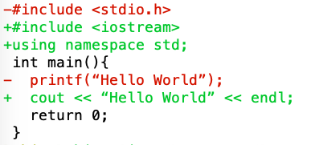

# Programming Language Homework 1

### Author： F74054122 林家緯

## Environment

macOS Mojave 10.14.2

SBCL

[SBCL Official Website](http://www.sbcl.org/index.html)

## Problem 1.1 prime

#### 執行方式

```commonlisp
(prime n) ;; n is a positive integer
```

Example input:

```commonlisp
(prime 2)
```

Example output:

```commonlisp
True
```

#### Code

```commonlisp
(defun prime(n)
  (let ((a 2) (lim (isqrt n)))
  (loop
    (if (equal n 2) (return 'true))
    (if (equal (mod n a) 0) (return 'false))
    (setq a (+ a 1))
    (when (> a lim) 
      (return 'true)))))
```

#### 解釋

1. 如果輸入的是2， 直接 output True
2. 從 2 開始檢查所有自然數直到根號 n， 檢查是否可以被整除，如果中間找得到數可以整除，則不是prime，若找不到數可以整除，則是prime


## Problem 1.2 palindrome

#### 執行方式

```commonlisp
(palindrome list) ;; list is a list of elements
```

Example input:

```
(palindrome ‘(cat dog bird bird dog cat))
```

Example output:

```
TRUE
```

#### Code

```common lisp
(defun palindrome (list)
  (cond 
    ((equal list (reverse list)) 'True)
    (t 'False)))
```

#### 解釋

1. 使用 ```(reverse)``` 將字串反轉
2. 使用 ```(equal)``` 比較原字串和反轉後字串，若相等，則為 palindrome


## Problem 1.3 fib

###Original Recursion

#### 執行方式

```commonlisp
(fib1 n) ;; n is an integer
```

Example input:

```
(fib1 3)
```

Example output:

```
2
```

#### Code

```commonlisp
(defun fib1 (n)
  (if (< n 2)
    n
    (+ (fib1 (- n 1)) (fib1 (- n 2)))))
```

#### 解釋

根據 Fibonacci Sequence 的定義，n < 2 時， 值為n， n >= 2時，值為 fib(n-1) + fib(n-2)，以此構造遞迴式

#### Trace

以下為 trace fib1(3) 的結果

```
* (fib1 3)
  0: (FIB1 3)
    1: (FIB1 2)
      2: (FIB1 1)
      2: FIB1 returned 1
      2: (FIB1 0)
      2: FIB1 returned 0
    1: FIB1 returned 1
    1: (FIB1 1)
    1: FIB1 returned 1
  0: FIB1 returned 2
2
```

可以看到此函數做的不是 Tail Recursion，當要運算的數字很大時，很容易發生 stack overflow

###Tail Recursion

#### 執行方式

```commonlisp
(fib2 n) ;; n is an integer
```

Example input:

```
(fib1 3)
```

Example output:

```
2
```

#### Code

```commonlisp
(defun fib2 (n)
  (defun fib-tailrec(index prev current)
    (cond ((= index 0) current)
          (t (fib-tailrec (- index 1) (+ prev current) prev))))
  (fib-tailrec n 1 0))
```

#### 解釋

解法參考[這篇 Blog](<https://medium.com/@frank.tan/fibonacci-tail-recursive-explained-876edf5e86fc>)

以求 fib(10) 為例


使用第一種方法時，為了得到第 n 個數字，必須先知道第 n-1 和 n-2 數字，因此造成非 tail recursion

當使用第二種方法，我們將 Fibonacci 反過來求，先 recursive 到最底， 然後再往上加數字，就可以達成 tail recursion 的目的

#### Trace

以下為 trace fib2(3) 中的函數 fib-tailrec 的結果

```
* (fib2 3)
  0: (FIB2 3)
    1: (FIB-TAILREC 2 1 1)
      2: (FIB-TAILREC 1 2 1)
        3: (FIB-TAILREC 0 3 2)
        3: FIB-TAILREC returned 2
      2: FIB-TAILREC returned 2
    1: FIB-TAILREC returned 2
  0: FIB2 returned 2
2
```

可以看到函數先 recursive 到最底，再一層一層return，達到 tail recursion


## Problem 2 merge sort

#### 執行方式

````
$ sbcl --script mergesort.lsp
````

Example input:

```
10
9 8 16 2 7 199 0 98 1 29
```

Example output:

```
0 1 2 7 8 9 16 29 98 199
```

#### Code

```commonlisp
(defun mergesort (numbers)
  (if (eq (length numbers) 1)
    ;; If list length = 1, return list
    numbers
    ;; Merge two lists
    (merge 'list
      ;; First list
      (mergesort (subseq numbers 0 (floor (length numbers) 2)))
      ;; Second list
      (mergesort (subseq numbers (floor (length numbers) 2)))
      ;; Merge in ascending order
      #'<
    )))

; Main function
(let 
  ((n (read))
  (numbers))
  (setf numbers
    (do 
      ((i 0 (+ i 1))
        (tmp nil)
      )
      ((>= i n) (reverse tmp))
      (setf tmp (cons (read) tmp))))
  (format t "~{~A ~}~%" (mergesort numbers)))
```

#### 解釋

重點看 merge sort 函數的部分

```commonlisp
(defun mergesort (numbers)
  (if (eq (length numbers) 1)
    ;; If list length = 1, return list
    numbers
    ;; Merge two lists
    (merge 'list
      ;; First list
      (mergesort (subseq numbers 0 (floor (length numbers) 2)))
      ;; Second list
      (mergesort (subseq numbers (floor (length numbers) 2)))
      ;; Merge in ascending order
      #'<
    )))
```

使用 merge sort 的 divide-and-conquer 的概念，每次將進來的數列對半分開，直到分到最小單位(一個數字) 再使用 lisp 的 function ```(merge)``` 來將兩個數列為一組 merge 在一起


## Problem 3 diff

#### 執行方式

```
(file1.txt)
#include <stdio.h>
int main(){
  printf(“Hello World”);
  return 0;
}

(file2.txt)
#include <iostream>
using namespace std;
int main(){
  cout << “Hello World” << endl;
  return 0;
}

(Put file1 and file2 and diff.lsp under same folder)

$ sbcl --script diff.lsp
```

Example Output:

（註：在terminal裡會輸出不同顏色）

```terminal
-#include <stdio.h>
+#include <iostream>
+using namespace std;
 int main(){
-  printf(“Hello World”);
+  cout << “Hello World” << endl;
   return 0;
 }
```


In Terminal:



#### Code


```commonlisp
;; Function that computes longest common subsequence(lcs)
(defun lcs (a b)
  (cond
    ((or (null a) (null b)) nil)
    ((equal (car a) (car b))
       (cons (car a) (lcs (cdr a) (cdr b))))
    (t (longest (lcs a (rest b)) (lcs (rest a) b)))))

(defun longest (a b)
  (if (> (length a) (length b)) a b))

;; Compute diff info using lcs obtained from lcs function
(defun diff (list1 list2 difflist)
  (do ((dif (pop difflist)))
    ((and (null list1) (null list2) (null difflist)))
    (do ((e1 (pop list1) (pop list1)))
      ((equal e1 dif))
      (format t "~c[31m-~a~c[0m~%" #\ESC e1 #\ESC)
    )
    (do ((e2 (pop list2) (pop list2)))
      ((equal e2 dif))
      (format t "~c[32m+~a~c[0m~%" #\ESC e2 #\ESC)
    )
    (if
      (not (null dif))
      (format t " ~a~%" dif)
    )
    (setq dif (pop difflist))
  )  
)

;; Main function

;; Get file descriptors
(let (fd1 fd2 input1 input2)
(setq fd1 (open "./file1.txt"))
(setq fd2 (open "./file2.txt"))

;; Read in file line by line
(setq input1 ())
(setq input2 ())
(loop for line = (read-line fd1 nil nil)
  while line
  do (push line input1))
(loop for line = (read-line fd2 nil nil)
  while line
  do (push line input2))
(setq input1 (reverse input1))
(setq input2 (reverse input2))

;; Compute diff and output to console
(diff input1 input2 (lcs input1 input2)))
```

#### 解釋

diff 最重要的精神是 Longest Common Subsequence(LCS)，先求出兩個文件的 LCS

* 用第一個文件和 LCS 結果相比，就可以得到刪除的部分

* 用第二個文件和 LCS 結果相比，就可以得到增加的部分

函數 ```(lcs)``` 是用來求兩個文件的 Longest Common Subsequence

函數```(diff)``` 則是做三件事：

1. 先拿出 LCS 的第一個元素 dif
2. 輸出 list1 中 dif 之前的元素，標示為 -
3. 輸出 list2 中 dif 之前的元素，標示為 +
4. 若dif不為空，輸出 dif
5. pop LCS 第一個元素
6. 回到 1.

（註：當 LCS 被 pop 完後，dif 值是 NIL， 所以個會依序把 list1 和 list2 中剩下的元素印完)
