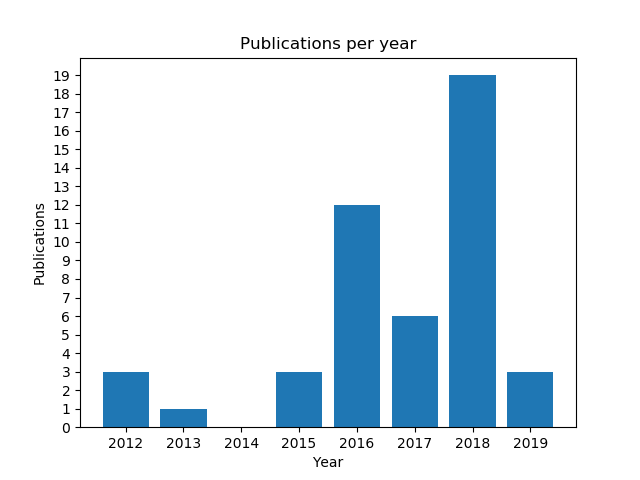
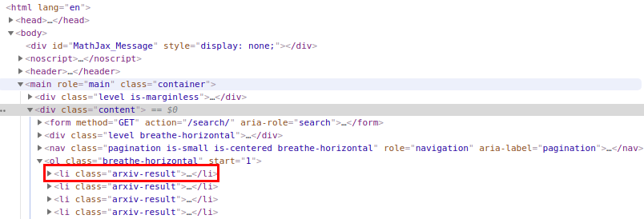
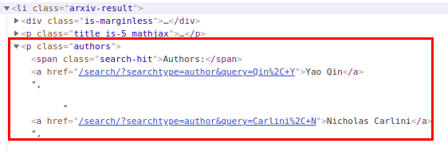
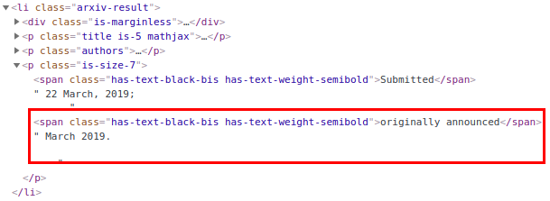

# Programming Language HW2

Author：林家緯 F74054122

### Objective

利用 re 和 urllib 實作一個簡單的 python 爬蟲程式，可以爬取某一作者在 arXiv 的所有論文，有兩個功能

1. 畫出作者每一年的論文數量 bar graph
2. 列出所有和作者共同完成論文的其他作者，並統計每一位 co-author 出現的次數

### Usage

1. 執行程式

   ``` $ python paper_parser.py ```

   *requires python 3.6 or above

2. 程式會先詢問想要查詢的作者

```
Input Author:
```

3. 輸入想要查詢的作者

```
Input Author:Ian Goodfellow
```

4. 程式會畫出此作者每年的論文發表數量

   

5. 程式會列出所有co-author並且按字母順序排列（此處只列出5筆）

   ```
   [ Aaron Courville ]: 2 times
   [ Abhibhav Garg ]: 1 times
   [ Alan Yuille ]: 1 times
   [ Alec Radford ]: 1 times
   [ Aleksander Madry ]: 1 times
   [ Alex Kurakin ]: 1 times
   [ Alexander Matyasko ]: 1 times
   ...
   ```

### Implementation

程式主要分爲 8 部分

1. 獲取 user 的 Input 並處理
2. 通過 urllib 獲取 arXiv 查詢內容
3. 利用 Regular Expression 定位每一筆 result
4. 確認當筆中有出現作者
5. 在每一筆 result 中定位作者
6. 在每一筆 result 中定位發表年份
7. 整理年份資料並繪圖
8. 整理 co-author 資料並輸出


#### 1. 通過 urllib 獲取 arXiv 查詢內容

```python
author = input('Input author:')
query_author = author.replace(" ","+")
```

將使用者輸入的空格轉爲 ‘+’ 以利之後查詢


#### 2. 通過 urllib 獲取 arXiv 查詢內容

```python
url = 'https://arxiv.org/search/?query="' + query_author + \ '"&searchtype=author&abstracts=hide&size=200'
content = urllib.request.urlopen(url)
html_str = content.read().decode('utf-8')
```

1. 爲 author 加上雙引號搜尋準確結果
2. search type 設定爲 author
3. abstract 設定爲 hide，不請求論文摘要，節省資料大小
4. size 設定爲 200，獲得所有論文
5. 使用 utf-8 解碼


#### 錯誤處理

```python
if len(result) == 0:
    print('Sorry, your query for author: "' + author + '" produced no results.')
    quit()
```

如果搜尋結果爲空，則退出程序


#### 3. 利用 Regular Expression 定位每一筆 result

思考：觀察網頁，可以發現每一筆論文結果都在 arxiv-result 的 class 中



```python
result_pattern = '<li class="arxiv-result"[\s\S]*?</li>'
result = re.findall(result_pattern, html_str)
if len(result) == 0:
    print('Sorry, your query for author: "' + author + '" produced no results.')
    quit()
```

利用 re.findall() 尋找所有對應的 pattern，如果沒有找到，則搜尋沒有結果


#### 4. 確認當筆中有出現作者

觀察：在 arXiv 的結果中，會有出現不是搜尋作者的論文的情況，所以應該排除不算

```python
author_flag = False
authors_pattern = '<a href="[\s\S]*?</a>'

authors_names = re.findall(authors_pattern, authors_list)
for name in authors_names:
    full_name = name.split('>')[1].split('</a')[0].strip()
    if full_name.lower() == author.lower():
        author_flag = True

    if full_name[0:2] == 'et':
        continue
```

利用一個 flag 來表示這一篇論文中是否有出現搜尋作者的名字（以小寫來匹配）

如果 author_flag 爲 True，才繼續做之後的 5~8 步驟


#### ５. 在每一筆 result 中定位作者

思考：在每一個 arxiv-result 中，有一個欄位包括所有作者，每一個作者都是一個 anchor tag



```python
#(此部分只貼出部分程式碼)

authors_pattern = '<a href="[\s\S]*?</a>'

authors_list = r.split('<p class="authors">')[1].split('</p>')[0]
authors_names = re.findall(authors_pattern, authors_list)
for name in authors_names:
    full_name = name.split('>')[1].split('</a')[0].strip()
    if full_name[0:2] == 'et':
        continue
    co_author_dict[full_name] += 1
```

1. 在 arxiv-result 中找出每一個作者的 anchor tag
2. 從 anchor tag 中取出作者名字，利用切字串的方法，取出 '>' 到 '</a' 中的內容
3. 如果作者名字取到 et， 則不算在內，跳過
4. 將作者名字加入一個以作者名字爲 key，作者出現次數爲 value 的 dict


#### ６. 在每一筆 result 中定位發表年份

思考：論文發表日期被包在 class=is-size-7 裏面，並且分爲 Submitted 和 originally announced 兩部分，以 originally announced 日期爲準



```python
#(此部分只貼出部分程式碼)

date_pattern = '<span class="has-text-black-bis has-text-weight-semibold">originally announced</span>[\s\S]*'

date_str = r.split('<p class="is-size-7">')[1].split("</p>")[0]
date = re.findall(date_pattern, date_str)[0].split('>')[2].strip().split('.')[0]
year = date.split(' ')[1]
year_dict[year] += 1
```

1. 把在 class=is-size-7 內的內容切下來

2. 利用 regular expression 尋找 originally announced 部分

3. 從originally announced tag 的尾端切出日期

4. 從日期中切出年份

5. 將年份加入一個以年份爲 key，出現次數爲 value 的 dict

   

#### 錯誤處理

```python
if len(year_dict) == 0 or len(co_author_dict) == 0:
    print('Sorry, your query for author: "' + author + '" produced no results.')
    quit()
```

如果結果的 dictionary 沒有資料，則不進行繪圖，退出程序


#### ７. 整理年份資料並繪圖

```python
"""
year_dict
key: year
value: count
"""
min_year = int(min(year_dict, key=int))
max_year = int(max(year_dict, key=int))

x = np.arange(min_year, max_year+1)
y = np.zeros_like(x)

for year, count in year_dict.items():
    y[int(year)-min_year] = count

plt.figure()
xtick = x.copy()
plt.bar(x, y, align='center', tick_label=xtick)
plt.title('Publications per year')
plt.xlabel('Year')
plt.ylabel('Publications')
plt.yticks(range(0,max(y)+1))
plt.show()
```

1. 獲取等一下要畫圖年份的最大最小值
2. 把每一年的數量填入 y 中
3. 使用 matplotlib 畫圖
4. 設定 yticks 以保證每一格都是整數


#### ８. 整理 co-author 資料並輸出

```python
"""
co_author_dict
key: author name
value: count
"""
for name, times in sorted(co_author_dict.items()):
    if name == author:
        continue
    print('[ %s ]: %d times'%(name, times))
```

用 sorted 排序 dict 中的作者姓名，再一個一個輸出

如果 name 和作者名字一樣，則跳過


